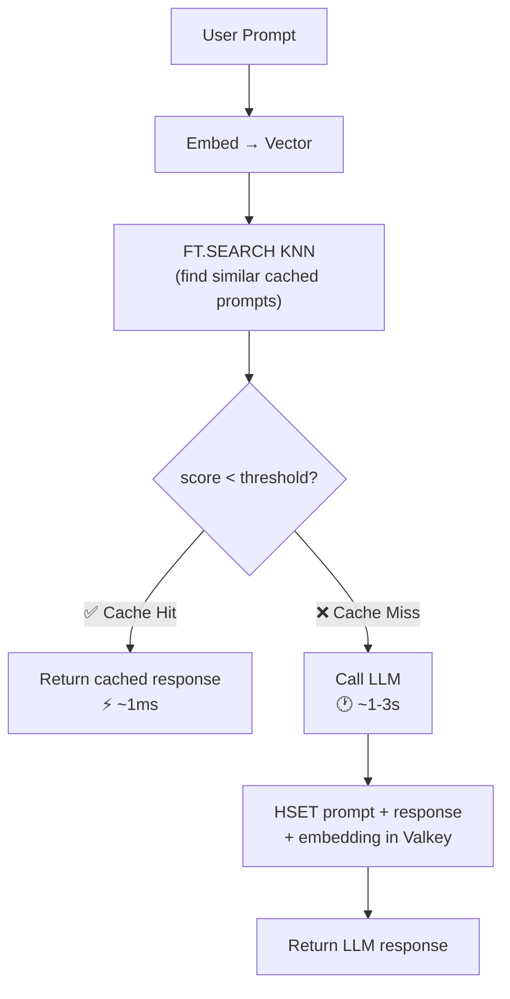

## How Semantic Caching Works

Gist

```
User Prompt → Embed → FT.SEARCH KNN → Hit?  → Return cached response (~1ms)
                                      Miss? → Call LLM (~1-3s) → HSET in Valkey → Return
```

Diagram



> **Why semantic, not exact?** "What is Valkey?" and "Can you explain what Valkey is?" are different strings but mean the same thing. Exact-match caching misses these. Semantic caching uses vector similarity to match by *meaning*, dramatically increasing hit rates.

## Prerequisites

- Valkey with the **valkey-search** module loaded (or ElastiCache for Valkey 8.2+ or Memorystore for Valkey 8+)
- Python 3.12+ with `valkey`, `openai`, `numpy` and `python-dotenv`

## Step 1: Start Valkey

1.1 - If you haven't already started a `Valkey` server with the `valkey-search` module you can start with the `valkey-bundle` container.

```bash
docker run -d --name valkey -p 6379:6379 valkey/valkey-bundle:9-alpine
```

## Step 2: Setup

2.1 - Create a `.env` file with the following environment variables:

```bash
OPENAI_API_KEY=<your_openai_api_key>
OPENAI_MODEL=gpt-5.1
```

2.2 - Install dependencies

```bash
uv pip install valkey openai numpy python-dotenv
```

2.3 - Connect to Valkey and OpenAI

```python
import os
from dotenv import load_dotenv

load_dotenv()

import valkey
import numpy as np
import json
import hashlib
import time
from openai import OpenAI

client = valkey.Valkey(host="localhost", port=6379)
openai_client = OpenAI()

EMBEDDING_MODEL = "text-embedding-3-small"
EMBEDDING_DIM = 1536
SIMILARITY_THRESHOLD = 0.15  # COSINE distance: 0=identical, 2=opposite
CACHE_TTL = 3600  # 1 hour
```

## Step 3: Create the Cache Index

```python
def create_cache_index():
    """Create a vector index for the semantic cache."""
    try:
        client.execute_command(
            "FT.CREATE", "cache_idx",
            "SCHEMA",
            "prompt", "TAG",
            "response", "TAG",
            "embedding", "VECTOR", "HNSW", "6",
            "TYPE", "FLOAT32",
            "DIM", str(EMBEDDING_DIM),
            "DISTANCE_METRIC", "COSINE",
        )
        print("Cache index created")
    except valkey.ResponseError:
        print("Cache index already exists")

create_cache_index()
```

## Step 4: Embedding Helper

```python
def get_embedding(text: str) -> bytes:
    """Embed text using OpenAI and return as FLOAT32 bytes."""
    response = openai_client.embeddings.create(
        model=EMBEDDING_MODEL,
        input=text,
    )
    vec = response.data[0].embedding
    return np.array(vec, dtype=np.float32).tobytes()
```

## Step 5: The Semantic Cache

```python
def semantic_cache_lookup(prompt: str) -> dict:
    """Check if a semantically similar prompt is cached."""
    query_vec = get_embedding(prompt)

    # KNN search: find the 1 nearest cached prompt
    results = client.execute_command(
        "FT.SEARCH", "cache_idx",
        "*=>[KNN 1 @embedding $query_vec]",
        "PARAMS", "2", "query_vec", query_vec,
        "DIALECT", "2",
    )

    if results[0] > 0:
        fields = results[2]
        # Decode bytes from FT.SEARCH results (skip binary embedding field)
        field_dict = {}
        for j in range(0, len(fields), 2):
            k = fields[j].decode() if isinstance(fields[j], bytes) else fields[j]
            try:
                v = fields[j+1].decode() if isinstance(fields[j+1], bytes) else fields[j+1]
            except UnicodeDecodeError:
                v = fields[j+1]  # binary field (embedding)
            field_dict[k] = v
        score = float(field_dict.get("__embedding_score", "999"))

        if score < SIMILARITY_THRESHOLD:
            return {
                "hit": True,
                "response": field_dict.get("response", ""),
                "cached_prompt": field_dict.get("prompt", ""),
                "score": score,
            }

    return {"hit": False}

def cache_response(prompt: str, response: str, embedding_bytes: bytes):
    """Store a prompt+response in the cache."""
    cache_key = f"cache:{hashlib.md5(prompt.encode()).hexdigest()}"
    client.hset(cache_key, mapping={
        "prompt": prompt,
        "response": response,
        "embedding": embedding_bytes,
        "created_at": str(time.time()),
    })
    client.expire(cache_key, CACHE_TTL)

def ask_with_cache(prompt: str) -> dict:
    """Main function: check cache first, then call LLM if needed."""
    start = time.time()

    # 1. Check cache
    cache_result = semantic_cache_lookup(prompt)

    if cache_result["hit"]:
        elapsed = (time.time() - start) * 1000
        return {
            "response": cache_result["response"],
            "source": "cache",
            "similarity_score": cache_result["score"],
            "latency_ms": round(elapsed, 1),
        }

    # 2. Cache miss - call LLM
    llm_response = openai_client.chat.completions.create(
        model="gpt-4",
        messages=[{"role": "user", "content": prompt}],
    )
    answer = llm_response.choices[0].message.content

    # 3. Cache the response
    embedding_bytes = get_embedding(prompt)
    cache_response(prompt, answer, embedding_bytes)

    elapsed = (time.time() - start) * 1000
    return {
        "response": answer,
        "source": "llm",
        "latency_ms": round(elapsed, 1),
    }
```

## Step 6: Test It

```python
# First call - cache MISS (calls LLM)
result1 = ask_with_cache("What is Valkey?")
print(f"Source: {result1['source']}, Latency: {result1['latency_ms']}ms")
# Source: llm, Latency: 1250.3ms

# Second call - semantically similar - cache HIT!
result2 = ask_with_cache("Can you explain what Valkey is?")
print(f"Source: {result2['source']}, Latency: {result2['latency_ms']}ms")
# Source: cache, Latency: 12.5ms  ← 100x faster!

# Third call - different topic - cache MISS
result3 = ask_with_cache("How do I cook pasta?")
print(f"Source: {result3['source']}, Latency: {result3['latency_ms']}ms")
# Source: llm, Latency: 980.7ms
```

## How It Works Under the Hood

| Step | Command | Latency |
|------|---------|---------|
| Create index | `FT.CREATE cache_idx SCHEMA ... VECTOR HNSW ...` | Once |
| Cache lookup | `FT.SEARCH cache_idx "*=>[KNN 1 @embedding $vec]"` | ~0.1ms |
| Store in cache | `HSET cache:key prompt "..." response "..." embedding [bytes]` | ~0.1ms |
| Set TTL | `EXPIRE cache:key 3600` | ~0.1ms |
| LLM call (miss) | OpenAI API | 500-3000ms |

> **Cost savings:** Every cache hit saves an LLM API call. At $0.03/1K tokens for GPT-4, a 60% hit rate on 10,000 daily requests saves ~$180/day. The Valkey lookup costs effectively nothing.
